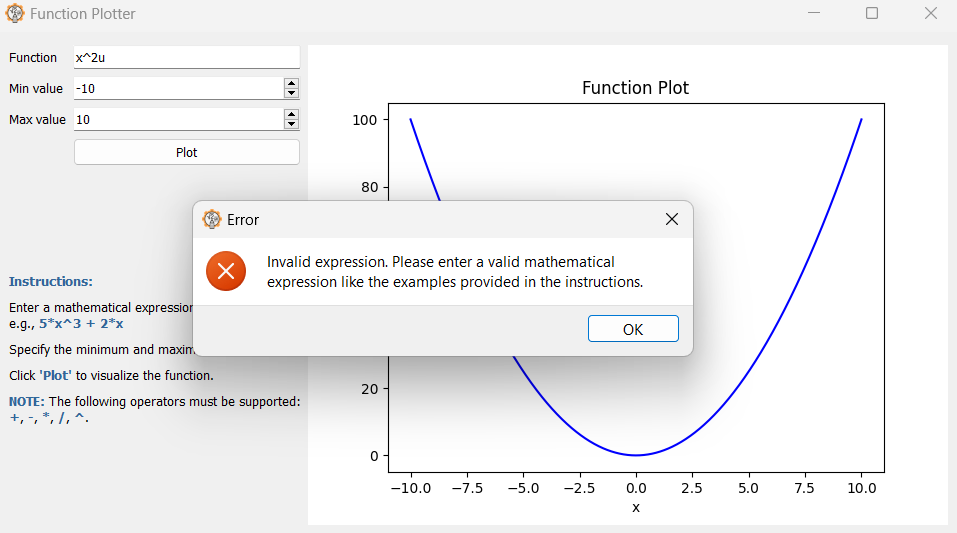

# Function Plotter

The Function Plotter is a simple application that allows users to visualize mathematical functions by plotting them on a graph. It provides a graphical user interface (GUI) where users can enter a mathematical expression, specify the range of values for the independent variable, and click a "Plot" button to generate the corresponding function plot.

## Features

- Graphical user interface using PySide2 library.
- Input fields for the mathematical expression, minimum value, and maximum value.
- Support for basic mathematical operators: +, -, *, /, ^ (exponentiation).
- Error handling for invalid expressions and ranges.
- Interactive plot generation using Matplotlib library.

## Installation

To run the Function Plotter, follow these steps:

1. Install the required dependencies by running the following command:
   
   ```
   pip install PySide2 matplotlib
   ```

2. Download the source code and navigate to the project directory.

3. Run the `main.py` script using Python:
   
   ```
   python main.py
   ```

## Usage

1. Enter a mathematical expression in function form, such as `5*x^3 + 2*x`.
2. Specify the minimum and maximum values for the independent variable, `x`.
3. Click the "Plot" button to visualize the function.
4. The plot will be displayed on the application window, showing the graph of the function within the specified range.

## Example

Here is an example of how to use the Function Plotter:

1. Enter the expression: `x^2`.
2. Set the minimum value to -10.
3. Set the maximum value to 10.
4. Click the "Plot" button.
5. The plot will show the graph of the function `x^2` within the range -10 to 10.

## photos to how to use


## in case of invalid range


## in case of invalid expression

